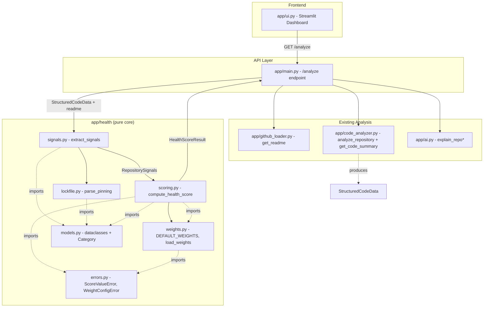

# Design Document

## Overview

The Repo Health Score feature adds a composite health score (0–100) with a per-category breakdown to RepoPilot. The score aggregates signals RepoPilot already derives from a GitHub repository — README content and source-file structure — into a single interpretable number plus category-level detail on the Streamlit dashboard.

Five categories are scored: README quality/completeness, documentation presence, test-coverage indicators, dependency freshness (based on how dependencies are pinned in local lockfiles), and README-vs-code consistency. Category weights are configuration-driven so they can be tuned without touching scoring logic. The scoring computation is a **pure function** operating only on already-collected raw signals — no new external GitHub calls or registry lookups are introduced for scoring itself.

The central design problem surfaced during codebase review: `app/code_analyzer.py` builds an internal structured dict (`files`, `languages`, `key_files`, `file_count`, `code_samples`) but **returns only a formatted text string**, discarding the structure. The scoring pipeline needs structured data, so this feature refactors the analyzer to expose a structured object while keeping the existing formatted-text path intact for the AI explanation flow.

A second review finding drives a specific design guarantee: the existing tree scan caps at `max_files=20` and only fetches contents of the first 5 key files. Lockfiles in large repos could therefore never be fetched, silently degrading Dependency_Freshness to a presence-only signal that never inspects pinning. The design guarantees that **detected lockfiles are always retained in the file list and always have their contents fetched**, independent of both caps.

Two further findings from post-implementation testing (observed on `mattpocock/skills`) generalize this guarantee. First, the tree scan admitted files via `is_important_file`, which **excludes Markdown** — a heuristic meant to pick AI content samples, but which silently prevented the Signal_Extractor from ever seeing documentation files, forcing a false `0` on Documentation for docs-heavy repositories. Second, `max_files` limited not only content fetching but also which paths were available for classification, starving test/CI/doc detection on larger repositories. The design therefore separates two concerns: a **Content_Fetch_Budget** (`max_files`, bounding only AI content fetches) and a **Signal_Classification_Set** (every classification-relevant path, unbounded by that budget). Additionally, the README-vs-code consistency vocabulary is broadened beyond bare language names to a curated framework/tooling/file-type set, and a README with no detectable references now yields a **limited-data** category (`missing_data=True`) rather than a confident `0`.

### Design Goals and Rationale

| Goal | Rationale |
| --- | --- |
| Pure, isolated scoring core | Requirement 5.4/5.5 mandate purity; enables property-based testing without network/AI/UI dependencies. |
| Structured signals, no text parsing | Requirement 1.4 forbids re-parsing the formatted summary; structured data is the reliable source. |
| No new external data sources | Scope notes + Req 4.5 forbid registry lookups; all signals reuse the existing fetch flow. |
| Config-driven weights in a separate module | Requirement 6.1/6.2 require weights outside scoring code so tuning needs no scoring change. |
| Additive, gated API changes | Requirement 7.3 forbids altering existing response fields; enablement flag keeps the change opt-in. |
| Guaranteed lockfile fetch | Prevents Dependency_Freshness from silently degrading on large repos (review finding). |

## Architecture

The feature introduces a new `app/health/` package containing the pure scoring core and its supporting modules, plus a refactor of `app/code_analyzer.py` to expose structured data. The API layer (`app/main.py`) orchestrates signal extraction and scoring behind an enablement flag; the dashboard (`app/ui.py`) renders the result. The pure core has **no** dependency on `requests`, `fastapi`, `streamlit`, `openai`, or `app.main`.

### Component Diagram



Dependency direction is strictly inward: `scoring.py` imports only `models`, `weights`, `errors`, and stdlib. `signals.py` and `lockfile.py` likewise import only stdlib + local models. Only `main.py` bridges the network/analysis layer to the pure core.

### Data-Flow Sequence Diagram

```mermaid
sequenceDiagram
    participant UI as Dashboard (ui.py)
    participant API as /analyze (main.py)
    participant GH as github_loader
    participant CA as code_analyzer
    participant SIG as health.signals
    participant LOCK as health.lockfile
    participant SCORE as health.scoring

    UI->>API: GET /analyze (owner, repo, include_code)
    API->>GH: get_readme(owner, repo)
    GH-->>API: readme text

    Note over API,CA: Structured analysis (reused for scoring; no extra scoring calls)
    API->>CA: analyze_repository(owner, repo)
    CA->>CA: scan tree (cap non-lockfiles at max_files;<br/>ALWAYS retain detected lockfiles)
    CA->>CA: fetch key-file samples (first 5)
    CA->>CA: fetch EVERY detected lockfile's content
    CA-->>API: StructuredCodeData (files, languages,<br/>key_files, file_count, file_contents incl. all lockfiles)

    alt HEALTH_SCORING_ENABLED
        API->>SIG: extract_signals(readme, structured_data)
        SIG->>LOCK: parse_pinning(name, content) per lockfile
        LOCK-->>SIG: DependencyPinning(total, unpinned)
        SIG-->>API: RepositorySignals (availability flags,<br/>consistency_ratio, dependency counts)
        API->>SCORE: compute_health_score(signals, weights)
        SCORE-->>API: HealthScoreResult (composite + 5 CategoryScores)
        API-->>UI: {repo, analysis, includes_code, health:{available:true,...}}
    else scoring disabled or failure
        API-->>UI: {repo, analysis, includes_code, health:{available:false, reason}}
    end

    UI->>UI: render composite + breakdown OR unavailability reason
```

### Guaranteed Signal Classification and Lockfile Fetch (Design Guarantee)

This is a first-class design guarantee, not an implementation detail:

0. **Classification is not gated by content-selection heuristics (Req 1.8/1.9).** The `is_important_file` heuristic exists to pick which files' *contents* are worth fetching for the AI summary; it excludes Markdown and other non-source files by design. That heuristic MUST NOT decide what the Signal_Extractor can *classify*. The tree scan therefore retains, in `StructuredCodeData.files`, every path matching a classification predicate — documentation (Markdown/reStructuredText/`docs/` entries), test, CI_Config, and Lockfile — regardless of `is_important_file`. Without this, documentation-heavy repositories score a false 0 on Documentation because their `.md` files never reach the classifier (observed on `mattpocock/skills`).
1. **Tree scan retention.** During the repository tree scan, files matching the lockfile predicate are **always** retained in `StructuredCodeData.files`, even if they fall beyond the content-fetch budget. The `max_files` budget governs only which *non-lockfile file contents* are fetched for the AI summary; it does not remove classification-relevant paths from `files`. The scan appends classification-relevant and lockfile paths unconditionally so they cannot be dropped by the early `break`.
2. **Content fetch.** The analyzer fetches the contents of **every** detected lockfile and stores them in `StructuredCodeData.file_contents`. This is separate from and additional to the existing first-5-key-files sample fetch.
3. **Bounded cost.** This adds at most one extra content fetch per detected lockfile. Lockfiles are few per repository, so the cost is small and bounded. It introduces **no** new external data source or registry lookup — lockfile content fetching is part of the same repo-analysis fetch flow as README and key-file fetches. The pinning *derivation* itself issues no network request (Req 4.5).
4. **Expected vs. rare case.** The expected path is: lockfile detected → contents fetched → parsed for pinning. "Present but contents unavailable" (counts toward presence only; `total=0`, `unpinned=0`) is a **rare error fallback** for genuine fetch-failure or unparseable cases only — not the normal outcome for large repos.

## Components and Interfaces

### Module Layout

```
app/
  code_analyzer.py        # refactored: adds analyze_repository(); get_code_summary() unchanged signature
  health/
    __init__.py           # package exports
    models.py             # frozen dataclasses + Category enum + StructuredCodeData
    signals.py            # extract_signals(): StructuredCodeData + README -> RepositorySignals
    lockfile.py           # parse_pinning(): format-dispatched pinning derivation
    scoring.py            # compute_health_score(): pure scoring core
    weights.py            # DEFAULT_WEIGHTS + load_weights()/normalize + validation
    errors.py             # ScoreValueError, WeightConfigError
tests/
  health/
    test_signals.py
    test_lockfile.py
    test_scoring.py
    test_weights.py
    test_properties.py     # property-based tests (hypothesis)
```

### `app/code_analyzer.py` (refactor)

New structured entry point plus a thin adapter that preserves the existing AI path.

```python
def analyze_repository(owner: str, repo: str, max_files: int = 20) -> StructuredCodeData:
    """Scan the repo tree and fetch contents, returning STRUCTURED data.

    - `max_files` is the Content_Fetch_Budget: it bounds only how many
      non-lockfile file CONTENTS are fetched for the AI summary. It does NOT
      limit which paths appear in `files` for signal classification (Req 1.9).
    - `files` retains every classification-relevant path (documentation, test,
      CI_Config) and every detected lockfile, regardless of the budget
      (Req 1.8). Detected lockfiles are ALWAYS retained.
    - `file_contents` includes the first-5-key-file samples AND every detected lockfile.
    Reuses the existing GitHub fetch flow; no registry lookups.
    """

def get_code_summary(owner: str, repo: str) -> str:
    """Unchanged public signature. Now a thin adapter: calls analyze_repository()
    and formats the structured data into the same free-text summary the AI path uses."""
```

- `is_important_file` / `get_file_language` / `LANGUAGE_EXTENSIONS` are retained and reused, but `is_important_file` scopes ONLY the AI content-fetch selection. Classification-relevant paths (documentation/test/CI_Config/Lockfile predicates) are retained in `files` independently of `is_important_file`, so excluding Markdown from AI sampling no longer suppresses Documentation classification (Req 1.8).
- A new `is_lockfile(path)` predicate recognizes `requirements.txt`, `package.json`, `pyproject.toml`, `setup.py`, `go.mod`, `Cargo.toml`, and similar manifests.
- The formatted-text output produced by `get_code_summary` remains byte-for-byte compatible with today's summary so `explain_repo_with_code` is unaffected.

### `app/health/signals.py`

```python
def extract_signals(readme: str | None, code: StructuredCodeData | None) -> RepositorySignals:
    """Transform already-collected README text and structured code data into
    a RepositorySignals object. No external network requests (Req 1.5, 3, 4.5)."""
```

Responsibilities:
- Classify files into documentation, test, and CI_Config groups by path pattern (Req 1.3). Classification operates over the Signal_Classification_Set — the full set of classification-relevant paths retained by `analyze_repository` — and is NOT limited to the AI content-fetch selection (Req 1.8/1.9). In particular, Markdown/`docs/` paths must be visible here even though `is_important_file` excludes them from AI sampling.
- Detect lockfiles and, for each, call `lockfile.parse_pinning` to aggregate `dependency_total` / `dependency_unpinned` (Req 4).
- Derive README-vs-code consistency: tokenize the README, match tokens case-insensitively against the **Technology_Reference_Vocabulary**, deduplicate case-insensitively, and compute the match ratio in [0.0, 1.0] (Req 3.1-3.5). The vocabulary is composed of module-level constants (no network; pure/deterministic):
  - **Known language names** (`KNOWN_LANGUAGES`) — matched against detected languages (existing behavior).
  - **Known key-file / manifest names** (`LOCKFILE_NAMES`) — matched against detected key files (existing behavior).
  - **`TECH_REFERENCE_TERMS`** (new) — a curated, offline set of **file-type / config indicators (Group A)**. Each term is paired with a concrete code-side detector so a README mention only counts as a *match* when the corresponding artifact is actually present in the file tree; otherwise it is a mismatch (never a vacuous match). Group A starter set:

    | README term(s) | Detected when the file tree contains |
    |---|---|
    | `docker`, `dockerfile` | a `Dockerfile` |
    | `docker-compose`, `compose` | `docker-compose.yml` / `docker-compose.yaml` / `compose.yaml` |
    | `kubernetes`, `k8s` | a `k8s/`/`kubernetes/` dir entry or a `Chart.yaml` |
    | `helm` | a `Chart.yaml` or `helm/` dir entry |
    | `terraform` | a `*.tf` file |
    | `make`, `makefile` | a `Makefile` |
    | `graphql` | a `*.graphql` / `*.gql` file |
    | `github actions`, `workflow` | a `.github/workflows/*` entry (also the CI signal) |

  A README that references a project by tooling/config (not by a bare language keyword) can therefore match. **Group B (framework/ecosystem terms matched against manifest *contents* — e.g. React/Django/FastAPI named as dependencies)** is explicitly **out of scope** for this change and is deferred to a future requirement; it requires parsing manifest dependency lists and a decision on "detected" semantics beyond file presence.
- Set per-category availability flags per Req 1.6/1.7, 3.6/3.7, 4.6. When the README yields **no** detectable references (Req 3.6) or the code side has no languages and no key files (Req 3.7), `consistency_available` is `False`, so scoring reports the category as **limited-data** (`missing_data=True`) rather than a confident `0` (Req 2.6, 7.5). This avoids the misleading hard-zero observed for content/config repositories such as `mattpocock/skills`.

### `app/health/lockfile.py`

```python
def parse_pinning(filename: str, content: str) -> DependencyPinning:
    """Format-dispatched by filename. Returns DependencyPinning(total, unpinned).
    Unknown format or unparseable content -> DependencyPinning(0, 0).
    No external network request (Req 4.5)."""
```

- Dispatch on filename: `requirements.txt` (pip specifiers), `package.json` (`dependencies`/`devDependencies` maps), `pyproject.toml`, `go.mod`, `Cargo.toml`.
- Pinned = exact version (e.g. `==1.2.3`, an exact npm version, a Go pseudo-version). Unpinned = wildcard, open/unbounded range, or no specifier (Req 4.2/4.3).

### `app/health/weights.py`

```python
DEFAULT_WEIGHTS: dict[Category, float]  # one non-negative weight per category

def load_weights(overrides: dict[Category, float] | None = None) -> dict[Category, float]:
    """Return the active weights (defaults unless overridden)."""

def normalize_weights(weights: dict[Category, float]) -> dict[Category, float]:
    """Validate then normalize to sum 1.0. Raises WeightConfigError for:
    - a missing category (names it),
    - negative or non-numeric weight,
    - sum of zero."""
```

Weights live here, separate from scoring, so tuning requires no scoring change (Req 6.1–6.3).

### `app/health/scoring.py`

```python
def compute_health_score(
    signals: RepositorySignals,
    weights: dict[Category, float] | None = None,
) -> HealthScoreResult:
    """PURE function. Imports only models, weights, errors, and stdlib.
    - Computes 5 integer CategoryScores (0-100) with the monotonic directions of Req 2.
    - Unavailable signal -> score 0, missing_data=True, still included in composite (Req 2.6).
    - Raises ScoreValueError if any category score is outside 0-100 (Req 5.6).
    - Normalizes weights at compute time; composite = round-half-up weighted sum,
      integer 0-100 (Req 5.1/5.2, 6.4)."""
```

- Round-half-up uses `math.floor(x + 0.5)` (scores are non-negative), avoiding Python `round()`'s banker's rounding.
- Imports are restricted to `math`, `app.health.models`, `app.health.weights`, `app.health.errors` — enforcing Req 5.5.

### `app/main.py` (additive change)

```python
HEALTH_SCORING_ENABLED = os.getenv("HEALTH_SCORING_ENABLED", "false").lower() == "true"
```

- `/analyze` continues to return `{repo, analysis, includes_code}` unchanged.
- When enabled, it reuses the already-fetched `readme` and calls `analyze_repository` (reusing the same structured data that `get_code_summary` now derives from), extracts signals, computes the score, and attaches a `health` block.
- On any failure during extraction or scoring, it attaches `health: {available: false, reason: ...}` while preserving all existing fields (Req 7.6).

### `app/ui.py` (additive change)

- Renders the composite score and a per-category breakdown when `health.available` is true.
- Shows a "limited data" indicator next to any category with `missing_data: true` (Req 8.4).
- Shows the unavailability reason and no scores when `health.available` is false (Req 8.5).
- Reuses the existing spinner as the in-progress indicator (Req 8.6).

## Data Models

All health data models are **frozen dataclasses** (immutable, hashable) to reinforce purity and determinism. `Category` is an enum.

```python
from dataclasses import dataclass, field
from enum import Enum

class Category(str, Enum):
    README_QUALITY = "README_Quality"
    DOCUMENTATION = "Documentation"
    TEST_COVERAGE = "Test_Coverage"
    DEPENDENCY_FRESHNESS = "Dependency_Freshness"
    README_CODE_CONSISTENCY = "Readme_Code_Consistency"


@dataclass(frozen=True)
class StructuredCodeData:
    """Structured output of the refactored code_analyzer (replaces discarded dict).

    file_contents is GUARANTEED to include EVERY detected lockfile's content
    (when fetchable) IN ADDITION TO the existing first-5-key-file samples.
    files retains all detected lockfile paths regardless of the max_files cap.
    """
    files: tuple[str, ...]
    languages: dict[str, int]          # language name -> file count
    key_files: tuple[str, ...]
    file_count: int
    file_contents: dict[str, str]      # path -> content (all lockfiles + key-file samples)


@dataclass(frozen=True)
class ReadmeMetrics:
    """Completeness signals extracted from README text (Req 2.1)."""
    length: int                        # char count
    heading_count: int
    code_block_count: int
    has_install_section: bool
    has_usage_section: bool


@dataclass(frozen=True)
class DependencyPinning:
    """Per-lockfile (or aggregated) pinning counts (Req 4)."""
    total: int                         # total dependency declarations
    unpinned: int                      # count classified as Unpinned_Dependency


@dataclass(frozen=True)
class RepositorySignals:
    """Structured raw inputs to scoring (the Repository_Signals object of Req 1)."""
    readme_text: str
    readme_metrics: ReadmeMetrics
    doc_files: tuple[str, ...]
    test_files: tuple[str, ...]
    ci_files: tuple[str, ...]
    lockfiles: tuple[str, ...]
    languages: dict[str, int]
    key_files: tuple[str, ...]

    dependency_total: int
    dependency_unpinned: int
    consistency_ratio: float           # 0.0-1.0 (Req 3.5)

    # Per-category availability flags (Req 1.6/1.7, 3.6/3.7, 4.6)
    readme_available: bool
    documentation_available: bool
    test_coverage_available: bool
    dependency_available: bool
    consistency_available: bool


@dataclass(frozen=True)
class CategoryScore:
    category: Category
    score: int                         # 0-100
    missing_data: bool                 # true when derived from unavailable signal (Req 2.6)


@dataclass(frozen=True)
class HealthScoreResult:
    composite: int                     # 0-100 (Req 5.2)
    categories: tuple[CategoryScore, ...]   # exactly the five categories (Req 5.3)
```

### Errors (`app/health/errors.py`)

```python
class HealthScoreError(Exception): ...

class ScoreValueError(HealthScoreError):
    """Raised when a category score falls outside 0-100 (Req 5.6). Names the category."""

class WeightConfigError(HealthScoreError):
    """Raised for missing/negative/non-numeric weight or zero-sum weights (Req 6.5/6.6)."""
```

## Correctness Properties

*A property is a characteristic or behavior that should hold true across all valid executions of a system — essentially, a formal statement about what the system should do. Properties serve as the bridge between human-readable specifications and machine-verifiable correctness guarantees.*

The pure core — `extract_signals`, the lockfile parser (`parse_pinning`), and `compute_health_score` — is the primary property-based-testing target. Each property below is universally quantified and maps to the requirement(s) it validates. Redundant criteria were consolidated during prework (e.g. determinism 2.7/5.4, match/mismatch partition 3.3/3.4, consistency availability 3.6/3.7, pinned/unpinned 4.2/4.3, availability flags 1.6/1.7, composite definition 5.1/5.2).

### Property 1: Every category score is within range

*For any* RepositorySignals and any valid Weight_Config, every CategoryScore in the resulting HealthScoreResult is an integer in the range 0 to 100 inclusive.

**Validates: Requirements 2.1, 2.2, 2.3, 2.4, 2.5**

### Property 2: README quality is monotonic in completeness

*For any* pair of ReadmeMetrics where the second dominates the first in every completeness dimension, the README_Quality score for the second is greater than or equal to that for the first.

**Validates: Requirements 2.1**

### Property 3: Documentation score rewards documentation presence

*For any* RepositorySignals, the Documentation score with documentation files present is greater than or equal to the score for otherwise-identical signals with no documentation files.

**Validates: Requirements 2.2**

### Property 4: Test coverage score rewards test files and CI

*For any* RepositorySignals, adding test files and/or CI_Config files never decreases the Test_Coverage score.

**Validates: Requirements 2.3**

### Property 5: Dependency freshness decreases with unpinned dependencies

*For any* fixed total dependency count, the Dependency_Freshness score is non-increasing as the count of Unpinned_Dependency instances rises, and lockfile presence never lowers the score relative to no lockfile.

**Validates: Requirements 2.4**

### Property 6: Consistency score is monotonic in match ratio

*For any* two consistency ratios r1 <= r2, the Readme_Code_Consistency score for r1 is less than or equal to the score for r2.

**Validates: Requirements 2.5**

### Property 7: Unavailable signal defaults to zero with missing_data

*For any* RepositorySignals in which a category's underlying signal is marked unavailable, that CategoryScore is 0, its missing_data indicator is true, and it is still present in the HealthScoreResult and included in the composite.

**Validates: Requirements 2.6**

### Property 8: Scoring is deterministic and pure

*For any* RepositorySignals and Weight_Config, computing the health score twice produces identical HealthScoreResult values.

**Validates: Requirements 2.7, 5.4**

### Property 9: Availability flags match data presence

*For any* README text and StructuredCodeData inputs, each RepositorySignals availability flag is true if and only if its corresponding source data is present; when a required input is absent, the affected fields hold empty collections or empty strings.

**Validates: Requirements 1.6, 1.7**

### Property 10: File classification partitions by pattern

*For any* list of file paths, the documentation, test, CI_Config, and lockfile groupings each contain exactly the paths matching their respective patterns.

**Validates: Requirements 1.3**

### Property 11: Technology-reference recognition is case-insensitive

*For any* README token, it is recognized as a detectable technology reference if and only if it matches a known language name or known key-file name when compared case-insensitively.

**Validates: Requirements 3.1**

### Property 12: Detectable references are deduplicated case-insensitively

*For any* README text, the derived set of unique detectable technology references contains no two references that are equal when compared case-insensitively.

**Validates: Requirements 3.2**

### Property 13: Matches and mismatches partition the reference set

*For any* set of unique detectable references and any detected code structure, the consistency matches and consistency mismatches are disjoint and their combined count equals the total number of unique detectable references; a reference is a match exactly when it corresponds to a detected language or detected key file.

**Validates: Requirements 3.3, 3.4**

### Property 14: Consistency ratio is well-defined and in range

*For any* set of unique detectable references and detected code structure with at least one reference, the Readme_Code_Consistency ratio equals matches divided by total unique references and lies in the range 0.0 to 1.0 inclusive.

**Validates: Requirements 3.5**

### Property 15: Consistency availability conditions

*For any* README text and code structure, the consistency availability flag is false when the README contains no detectable technology references, and false when the code structure contains no languages and no key files.

**Validates: Requirements 3.6, 3.7**

### Property 16: Lockfile parse preserves declaration count

*For any* set of dependency declarations rendered into a supported lockfile format, parsing that lockfile yields a total declaration count equal to the number of declarations rendered.

**Validates: Requirements 4.1**

### Property 17: Pinned/unpinned classification is correct

*For any* lockfile whose declarations are generated with a known pinned/unpinned split, the parser classifies exactly the exact-version declarations as pinned and exactly the wildcard, open/unbounded-range, and no-specifier declarations as Unpinned_Dependency.

**Validates: Requirements 4.2, 4.3**

### Property 18: Dependency counts aggregate across lockfiles

*For any* collection of detected lockfiles, the recorded `dependency_total` and `dependency_unpinned` equal the sums of the per-lockfile totals and unpinned counts respectively.

**Validates: Requirements 4.4**

### Property 19: Dependency availability requires a lockfile

*For any* code structure containing no detected lockfile, the Dependency_Freshness signal availability flag is false.

**Validates: Requirements 4.6**

### Property 20: Composite is the round-half-up weighted sum in range

*For any* RepositorySignals and valid Weight_Config, the composite equals the weighted sum of the five category scores using weights normalized to sum 1.0, rounded to the nearest integer with halves rounded up, and lies in the range 0 to 100 inclusive.

**Validates: Requirements 5.1, 5.2**

### Property 21: Result contains the composite and all five categories

*For any* RepositorySignals and valid Weight_Config, the HealthScoreResult contains a composite score and exactly one CategoryScore for each of the five defined categories.

**Validates: Requirements 5.3**

### Property 22: Out-of-range category score raises ScoreValueError

*For any* category score forced outside the range 0 to 100, `compute_health_score` raises ScoreValueError identifying the offending category and returns no composite.

**Validates: Requirements 5.6**

### Property 23: Composite is invariant under positive weight scaling

*For any* valid Weight_Config and any positive scale factor, multiplying every weight by that factor produces the same composite score (normalization invariance).

**Validates: Requirements 6.4**

### Property 24: Missing weight raises a named configuration error

*For any* Weight_Config that omits exactly one category weight, `compute_health_score` raises WeightConfigError identifying the missing category by name and returns no composite.

**Validates: Requirements 6.5**

### Property 25: Invalid weight configuration raises a configuration error

*For any* Weight_Config containing a negative weight, a non-numeric weight, or five weights summing to zero, `compute_health_score` raises WeightConfigError and returns no composite.

**Validates: Requirements 6.6**

## Error Handling

Errors are handled at three layers, keeping the pure core strict and the API layer resilient.

### Pure core (`app/health`)

- **Invalid category score** (`ScoreValueError`): if any computed category score falls outside 0–100, scoring raises immediately and returns no composite (Req 5.6). This is a programming-error guard, not an expected runtime path.
- **Weight configuration errors** (`WeightConfigError`): raised for a missing category (named), a negative or non-numeric weight, or a zero-sum weight set — before any composite is computed (Req 6.5/6.6).
- **Lockfile parsing failures**: `parse_pinning` never raises for content problems. Unknown formats and unparseable content return `DependencyPinning(0, 0)` (Req 4 fallback). Aggregation therefore degrades gracefully rather than failing the whole score.

### Signal extraction (`extract_signals`)

- **Absent README or code data**: affected fields are populated with empty collections/strings and their availability flags set to false (Req 1.6). No exception is raised for missing inputs — availability flags carry the information downstream, where categories become `missing_data` with score 0 (Req 2.6).
- **Lockfile present but contents unavailable**: this is the **rare error fallback**, not the expected case. Because the analyzer guarantees fetching every detected lockfile's contents, "present but contents unavailable" arises only from a genuine fetch failure or unparseable content. In that case the lockfile counts toward presence only (`total=0`, `unpinned=0`); dependency availability can still be true on presence, but pinning contributes nothing negative.

### Analysis API (`app/main.py`)

- **Scoring disabled**: when `HEALTH_SCORING_ENABLED` is false, the endpoint returns the existing response shape unchanged with no `health` block (or `health` omitted), fully backward compatible.
- **Extraction or scoring failure**: any exception from `extract_signals` or `compute_health_score` is caught; the endpoint returns all existing fields plus `health: {available: false, reason: <description>}` (Req 7.6). Existing fields are never omitted or altered (Req 7.3).
- **Per-category missing data**: successful results include a `missing_data` flag per category so the dashboard can flag limited-data scores (Req 7.5, 8.4).

### Additive API response shapes

Available:

```json
{
  "repo": "psf/requests",
  "analysis": "…existing AI explanation…",
  "includes_code": true,
  "health": {
    "available": true,
    "composite": 78,
    "categories": [
      {"category": "README_Quality",          "score": 90, "missing_data": false},
      {"category": "Documentation",            "score": 70, "missing_data": false},
      {"category": "Test_Coverage",            "score": 60, "missing_data": false},
      {"category": "Dependency_Freshness",     "score": 85, "missing_data": false},
      {"category": "Readme_Code_Consistency",  "score": 0,  "missing_data": true}
    ]
  }
}
```

Unavailable:

```json
{
  "repo": "psf/requests",
  "analysis": "…existing AI explanation…",
  "includes_code": true,
  "health": {
    "available": false,
    "reason": "Signal extraction failed: code structure unavailable"
  }
}
```

The `repo`, `analysis`, and `includes_code` fields are identical in both cases, preserving backward compatibility (Req 7.3).

## Testing Strategy

Property-based testing **is appropriate** for this feature: the scoring core, signal extraction, and lockfile parser are pure functions with clear input/output behavior and universal properties across a large input space (arbitrary signals, weights, file lists, README text, and lockfile contents). The API and dashboard layers are integration/wiring and UI concerns and are covered by example and integration tests rather than PBT.

### Tooling

- **Test runner:** `pytest` (added as a dev dependency).
- **Property-based testing:** `hypothesis` (added as a dev dependency). Property tests are not implemented from scratch — hypothesis generates inputs and shrinks counterexamples.
- Both are added to a dev/test dependency list (e.g. a `requirements-dev.txt` or the test extra), pinned to exact versions, and are not required by the runtime backend.

Because these are new dev dependencies, run the suite manually rather than in a watcher:

```
pytest --run  # or: pytest tests/health
```

### Dual testing approach

- **Property tests** (`tests/health/test_properties.py`) verify the 25 universal properties above across generated inputs. Each property is implemented as a **single** property-based test running a **minimum of 100 iterations**, tagged with a comment in the format:

  `# Feature: repo-health-score, Property {n}: {property text}`

  Hypothesis strategies generate: `ReadmeMetrics`, `RepositorySignals` with arbitrary availability flags, weight dictionaries (including invalid ones), file-path lists mixing doc/test/CI/lockfile patterns, README text seeded with known/unknown tokens in varied case, and lockfile contents with known pinned/unpinned splits.

- **Unit tests** (`test_signals.py`, `test_lockfile.py`, `test_scoring.py`, `test_weights.py`) cover specific examples, edge cases, and integration points that PBT does not target well:
  - **Round-half-up boundary example** — a weighted sum landing on exactly `x.5` must round up, guarding against Python `round()`'s banker's rounding (regression test for the `math.floor(x + 0.5)` decision).
  - **Empty inputs** — no README, no files, empty languages/key_files.
  - **Structured-not-text extraction** — `extract_signals` reads structured fields, never parses the formatted summary (Req 1.4).
  - **Import-boundary tests** — `app/health/scoring.py` imports only `math`, `models`, `weights`, `errors` (Req 5.5); `parse_pinning` and `extract_signals` perform no network I/O (Req 1.5, 4.5), verified by monkeypatching/mocking the network layer.
  - **Weight defaults** — `DEFAULT_WEIGHTS` defines all five categories, non-negative, in `weights.py` (Req 6.1).

### Integration tests (API layer)

Using FastAPI's `TestClient` with the GitHub/AI fetchers mocked:

- Enabled: `/analyze` returns a `health` block with the composite and all five numeric category scores in range (Req 7.1, 7.2).
- Additive: `repo`, `analysis`, `includes_code` remain present and unchanged alongside `health` (Req 7.3).
- Reuse: scoring issues no fetches beyond the existing analysis flow, asserted via mock call counts (Req 7.4).
- Missing data: a forced-unavailable signal surfaces `missing_data: true` for that category in the response (Req 7.5).
- Failure path: a forced extraction/scoring exception yields existing fields plus `health.available == false` with a reason (Req 7.6).

### Dashboard tests (UI layer)

The Streamlit rendering (Req 8) is verified by targeted example tests of the rendering helpers and manual verification: composite + per-category breakdown in one view, a limited-data indicator on `missing_data` categories, the unavailability reason with no scores when unavailable, and the existing spinner as the in-progress state. Streamlit rendering itself is not property-tested.

### Coverage summary

| Requirement group | Primary test type |
| --- | --- |
| Req 1 (extraction), 3 (consistency), 4 (pinning), 2 (category scores), 5 (composite), 6 (weights) — pure core | Property tests (100+ iterations) + unit tests |
| Req 5.5 / 1.5 / 4.5 (boundaries, no I/O) | Import-boundary + mock unit tests |
| Req 7 (API) | Integration tests (FastAPI TestClient, mocked fetchers) |
| Req 8 (Dashboard) | Example/manual UI tests |
